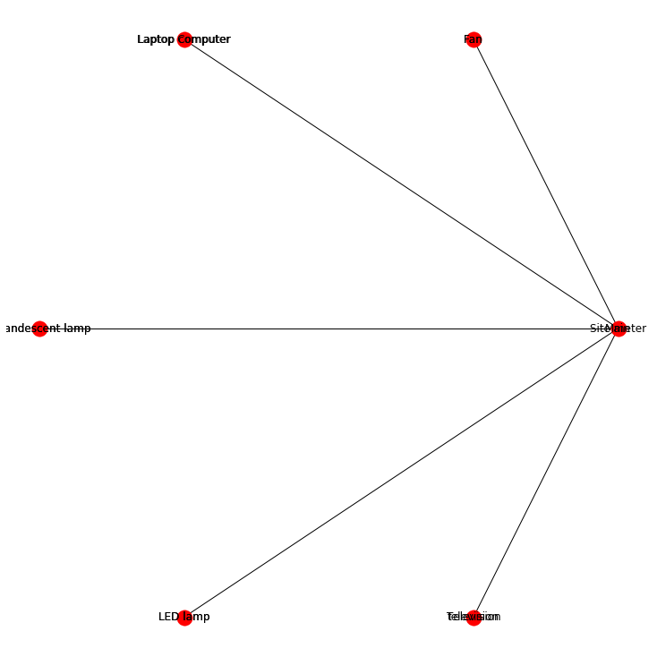

# Implementation of Nilmtk using new ESP32 based hardware on a RS485 bus with 6 PZEM004 meters.

By Carlos Rodriguez Navarro

Febrero de 2023

** **This excerpt refers to a paper by me on the OMPM published in the scientific journal "Inventions:" C. Rodríguez-Navarro, F. Portillo, F. Martínez, F. Manzano-Agugliaro, and A. Alcayde, "Development and Application of an Open Power Meter Suitable for NILM," *Inventions*, vol. 9, no. 1, p. 2, Dec. 2023, doi: doi: doi: 2023. Alcayde, "Development and Application of an Open Power Meter Suitable for NILM," *Inventions*, vol. 9, no. 1, p. 2, Dec. 2023, doi: 10.3390/inventions9010002.*** * *

**ABSTRACT:** 
*In the context of the global energy sector's increasing dependence on fossil fuels and growing environmental concerns, there is an urgent need for advances in energy monitoring and optimisation. To address this challenge, this study presents the Open Multi Power Meter, a novel open hardware solution designed for efficient and accurate electrical measurements. This device is designed around a unique microcontroller architecture, with a complete set of measurement modules interconnected through an RS485 bus, ensuring high accuracy and scalability. An important aspect of this development is the integration with the non-intrusive load monitoring toolkit, which uses advanced algorithms for energy disaggregation, including combinatorial optimisation and the finite hidden Markov model.

Comparative analyses were performed using public datasets along with commercial and open hardware monitors to validate the design and capabilities of this device. These studies demonstrate the remarkable effectiveness of the device, characterised by its simplicity, flexibility and adaptability in various energy monitoring scenarios. The introduction of this cost-effective and scalable tool marks a contribution to the field of energy research, improving energy efficiency practices. This research provides a practical solution for energy management and opens breakthroughs in the field, highlighting its potential impact on both academic research and real-world applications.

**Introduction**

Despite the large number of smart energy meter options available, there is a significant disparity in the performance and accuracy of energy monitors on the market, with some offering essential functions and others, such as the oZm, providing high accuracy but needing more scalability and expandability.
In this context, this paper presents the Open Multi Power Meter (OMPM), a solution to address these gaps, particularly in the field of non-intrusive load monitoring (NILM), which offers a balance between accuracy, scalability and ease of use. The OMPM is an open hardware solution whose firmware has also been developed in open source [11]. The open hardware nature of the device not only makes it accessible to a wider range of users, but also encourages innovation and customisation, allowing it to be adapted to specific operational or research needs.
Central to OMPM's utility is its compatibility with the Non-Intrusive Load Monitoring Toolkit (NILMTK) which employs advanced algorithms for energy disaggregation, a method that uses computational techniques to estimate the energy use of individual appliances from a single meter reading that records total energy demand. NILMTK's Combinatorial Optimisation (CO) and Finite Hidden Markov Model (FHMM) algorithms are particularly adept at dissecting complex energy usage patterns, making them ideal for evaluating OMPM performance. By leveraging these tools, the OMPM can provide detailed information on electricity consumption, leading to more informed energy management decisions and efficiency optimisation, as, without direct feedback, expecting consumers to actively participate in a sustainable and efficient energy system is unrealistic.
Comparative analysis of the OMPM and other public datasets, including measurements from commercial and open hardware monitors, underscores the accuracy and affordability of the device. The results of these comparisons validate the effectiveness of the OMPM and highlight its simplicity and adaptability, making it a valuable tool for a wide range of applications, from academic research to practical energy management solutions.
The introduction of the OMPM represents a significant contribution to smart metering and energy efficiency. It addresses critical gaps in current energy monitoring technologies and offers a scalable and cost-effective solution that can be adapted to the diverse needs of modern energy systems.
 
 ** The OMPM project**

The OMPM is an innovative development in the field of smart metering technology. It stands out by integrating a single microcontroller architecture with a set of measurement modules interconnected through an RS485 bus system, allowing the integration of multiple low-cost measurement modules as required. This design ensures a balance between high accuracy in electrical measurements and the flexibility required for large-scale implementation.

The new hardware used for the acquisition and capture of electrical measurements is based on the following components:

- ESP32 node MCU
- 6 x PZEM004
- SD card reader
- SD card
- RS485 bus
- Internet connection

The microcontroller used is an **ESP32 Node MCU** , to which an SD card adapter has been connected using the MISO /MOSI, CS and SCK lines of the controller. It is therefore on the SD card where we store the measurements using a CSV format file for each meter.

In the following image we can see in detail the connection of the SD adapter to the ESP32 controller.

Illustration 1-Detail of SD Reader connections

Illustration 2- Detail of sd reader connection to the ESP32

The measurement module PZEM004 measures the 5 fundamental electrical characteristics such as RMS voltage, RMS current, Active power and Energy with opto-coupled outputs and serial communication (comes with TTL serial interface, through various terminals to communicate with the adapter board, read, and set the parameters)..

Illustration 3-Block diagram PZEM004

In the assembly we have **6 PZEM 004 modules** with their respective Rogowsky coils that will be used to capture the current measurements for 6 electrical devices. The voltage measurements are taken by means of parallel wiring, which also feeds the 6 measurement modules.

The voltage, current, power, frequency and power factor measurements obtained by each module are sent via the RX and TX lines to the main controller using an RS485 bus.

The whole assembly is powered with +5 v DC directly from the USB bus itself as the power consumption of the Rx/Tx part of each PZEM004 module is very small as it is only required to power the optocouplers of the transmission part of each module.

The multi-function meter module PZEM-004T allows to measure the RMS voltage, RMS current, active power and energy consumption of a load connected to a single phase 110 / 220V line such as a cooker, refrigerator, motor, appliance, etc. .... this information can be sent to a microcontroller (for example Arduino or PIC), to a computer using a USB to TTL adapter, to a WiFi module (as in this case using an ESP32) or to a PLC.

This is the schematic of the final circuit that has been implemented (the display is optional):

Illustration 4- Circuit diagram

As shown in the diagram above, the RS485 bus is implemented by means of fast Shockley diodes on all the transmission lines of each PZEM004 module and a common 10K resistor between the positive and that line.

As for the ESP32 firmware, to use each PZEM004 module we must first program a unique address for each module so that each one is identified biunivocally.

These are the addresses of the individual counters:

- uint8_t addr0=0x110; //1first pzem is recognised as 10 aggregate consumption
- uint8_t addr1=0x120; //2first pzem is recognised as 20 socket 1
- uint8_t addr2=0x130; //2first pzem is recognised as 30 socket 2
- uint8_t addr3=0x140; //3first pzem is recognised as 40 socket 3
- uint8_t addr4=0x150; //4first pzem is recognised as 50 socket 4
- uint8_t addr5=0x160; //5first pzem is recognised as 60 socket 5

The complete acquisition software is attached in the final appendix. In summary, we initialise the SD card, capture the current date and time via a network connection and create 6 files for each application (see below).

Once the files are created, we add the headers in the first line, which will be used to identify the 5 measurements together with the 13-digit timestamp.

The body of the main program periodically takes all the readings of each meter, making sure beforehand that each meter is accessible and active (if it is not, it will stop the next one). Logically, each group of measurements is recorded in its corresponding file together with the value of the corresponding timestamp.

The program continuously monitors the total number of measurements taken for each meter to ensure that all meters are accessible and operational.

Los dispositivos contemplados conectados a cada módulo PZEM004, cuyas medidas se introducirán en NILMTK para su análisis, son los siguientes:

1 - Aggregate consumption meter

2 - Fan

3 - Laptop computer

4 - Halogen lamp

5 - LED Lamp

6 - 17" Computer Monitor

All measurements are captured at a frequency greater than approximately 1HZ. These are the electrical specifications of the measurements with the PZEM004:

**Voltage:**
- Measuring range: 80 \~ 260 V
- Resolution: 0.1 V
- Measuring accuracy: 0.5%.

**Current:**
- Measuring range: 0 \~ 10A (PZEM-004T-10A); 0 \~ 100A (PZEM-004T-100A)
- Initial measuring current: 0.01A (PZEM-004T-10A); 0. 024 (PZEM-004T-100A)
- Resolution: 0.001A
- Measuring accuracy: 0.5%.

**Active power:** 
- Measuring range: 0 \~ 2.3kW (PZEM-004T-10A);
- Initial measurement power: 0.4 W
- Resolution: 0.1 W
- Display format:
- \<1000 W, displays one decimal place, such as: 999.9 W
- ≥ 1000 W, displays only a whole number, such as: 1000 W
- Measurement accuracy: 0.5%.

 **Power factor** 
- Measuring range: 0.00 \~ 1.00
- Resolution: 0.01
- Measuring accuracy: 1%

**Frecuency**
- Measuring range: 45 Hz \~ 65 Hz
- Resolution: 0.1 Hz
- Measuring accuracy: 0.5%.

**Active energy:** 
- Measuring range: 0 \~ 9999.99kWh
- Resolution: 1 Wh
- Measuring accuracy: 0.5%.
- Display format:
- \<10kWh, display unit is Wh (1kWh = 1000Wh), such as: 9999Wh.
- ≥ 10kWh, the display unit is kWh, as: 9999.99kWh

Below is an image of the final assembly:

 **Disaggregation with NILMTK**

 
Both the code and all the results have been stored in the current Github repository in the form of Jupyter Notebook notebooks (for its execution it is required to have installed in addition to Jupyter Notebook the NILTK toolkit also available in Github). The dataset is also available in this same repository in HDFS5 format (the file is called dsualm2.h5). Also in this same repository is available the firmware for use with the ESP32.

Based on the DSUAL converter, a new converter called UALM2 has been created to generate the new dataset made up of 5 measurements, given that we do not have the reactive or apparent power calculation.

This is the scheme of the assembly obtained in step 2:

This is the fraction of consumption calculated for each appliance:

We can graphically display voltage, frequency, active power and current for all applications, e.g. aggregate:

It is very interesting to see how all the measurements are recorded, where it can be seen how in the first hour the 32 possibilities are recorded in sequential order and in the second hour it was randomised:

Illustration 5-Representation of the power of all counters on the timeline

As a first step we obtain a first estimation of the performance of the two algorithms, which in principle gives us an indication that the sampling time to be selected will be small:

Illustration 6- Preliminary execution data

The result already using many more sampling periods, the two algorithms CO and FHMM and the three different filling methods gives the following results:

Figure 7 - Results running three methods, two algorithms and times

As we can see, the most efficient combination is that of the combinatorial method, median fill method and 30 seconds of sampling.

In the image we can see how the results are quite good if we compare the real reading with the estimation given by the algorithm.

Illustration 8-Results CO method, 30 seconds, median method

The ratio of the disaggregated energy is as follows using CO, 30" and median method:

Figure 9 - Percentage of unbundled energy

Now we will see the comparison between the actual and the estimated signal, which is not very good data.

Illustration 10- Comparison of Actual Data and Predictions

Finally, applying the NILMTK metrics we obtain the following results for the F1, EAE, MNEAP and RMSE measures:

Illustration 11-Metric results

For metric F1, very good values are obtained for the fan, laptop (which is even better than the halogen lamp) or the LED lamp. The worst performer is the TV, although this value is not graphically understandable.

The MNEAP metric also gives very good values, the best being undoubtedly for the halogen lamp. The worst figure is again for the TV.

 

On the RMSE metric this time the data is very good for all applications.

Let us now look at the average l for the 4 metrics and the different sampling periods:

Let us now look at the different maximum results for the 4 metrics and the different applications:

This is the index correspondence:

Comparison of different metrics with different filling methods;

The very poor value for the F1 metric with respect to the TV using the three different filling methods is again noteworthy.

Finally, let's look at the results obtained for the different metrics and the different applications, observing again how for the fan we have no values.

**Conclusions**
This study presents a novel hardware-based solution characterised by scalability, affordability and replicability, while maintaining the high accuracy typical of professional-level solutions. The system uses open source software both in the microcontroller firmware and in the processing phase. This processing software is based on the NILMTK toolkit and is adapted to accommodate a new data set generated by this new hardware.

A highlight of this work is the development of a new converter adapted to the OMPM measurement files. This converter creates a new dataset that supports a 13-digit timestamp, which facilitates the implementation of the various phases of NILMTK, including validation, training and evaluation of metrics.
.

Significant differences emerge when comparing the results obtained from applying NILMTK metrics to the OMPM dataset with those derived from the DEPS dataset (generated with professional hardware). In particular, the OMPM dataset requires shorter sampling times and exhibits a remarkable 200% difference in RMSE metrics compared to the DEPS dataset.

The promising results obtained with the OMPM dataset using NILMTK metrics open up new possibilities for researchers to generate their datasets and further enhance NILM research. The scalability of the proposed solution, facilitated by the implementation of an RS485 bus, allows the use of multiple channels with a single microcontroller. This scalability guarantees the capture of all fundamental electrical measurements with commendable accuracy. Having been successfully evaluated with six modules, the number of circuits in a typical household, the system has the potential for future expansion to accommodate even more modules.

.

To evaluate this new hardware, low-power applications were chosen to increase the complexity of disaggregation tasks. The hardware performed highly satisfactorily on several metrics, suggesting its potential usefulness in NILM's ongoing research. Future work could focus on improving the accuracy of the measurement modules. Currently, each module is powered directly from the mains voltage by a simple RC circuit, a rectifier diode and a Zener diode, with a U3 (7133) regulator at the output. An improvement could be achieved by powering the regulator from an isolated, independent source, such as an R05P125, which offers a promising direction for further research and development.

**Publicaciones**

All this documentation concerning the OMPM is published in the scientific journal "Inventions:".

-   C. Rodríguez-Navarro, F. Portillo, F. Martínez, F. Manzano-Agugliaro, and A. Alcayde, “Development and Application of an Open Power Meter Suitable for NILM,” *Inventions*, vol. 9, no. 1, p. 2, Dec. 2023, doi: 10.3390/inventions9010002.

There is an article I have written about NILM but it uses OZM hardware instead of OMPM:

-   C. Rodriguez-Navarro, A. Alcayde, V. Isanbaev, L. Castro-Santos, A. Filgueira-Vizoso, and F. G. Montoya, “DSUALMH- A new high-resolution dataset for NILM,” *Renewable Energy and Power Quality Journal*, vol. 21, no. 1, pp. 238–243, Jul. 2023, doi: 10.24084/repqj21.286.

